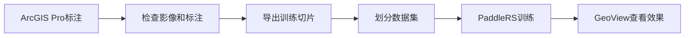
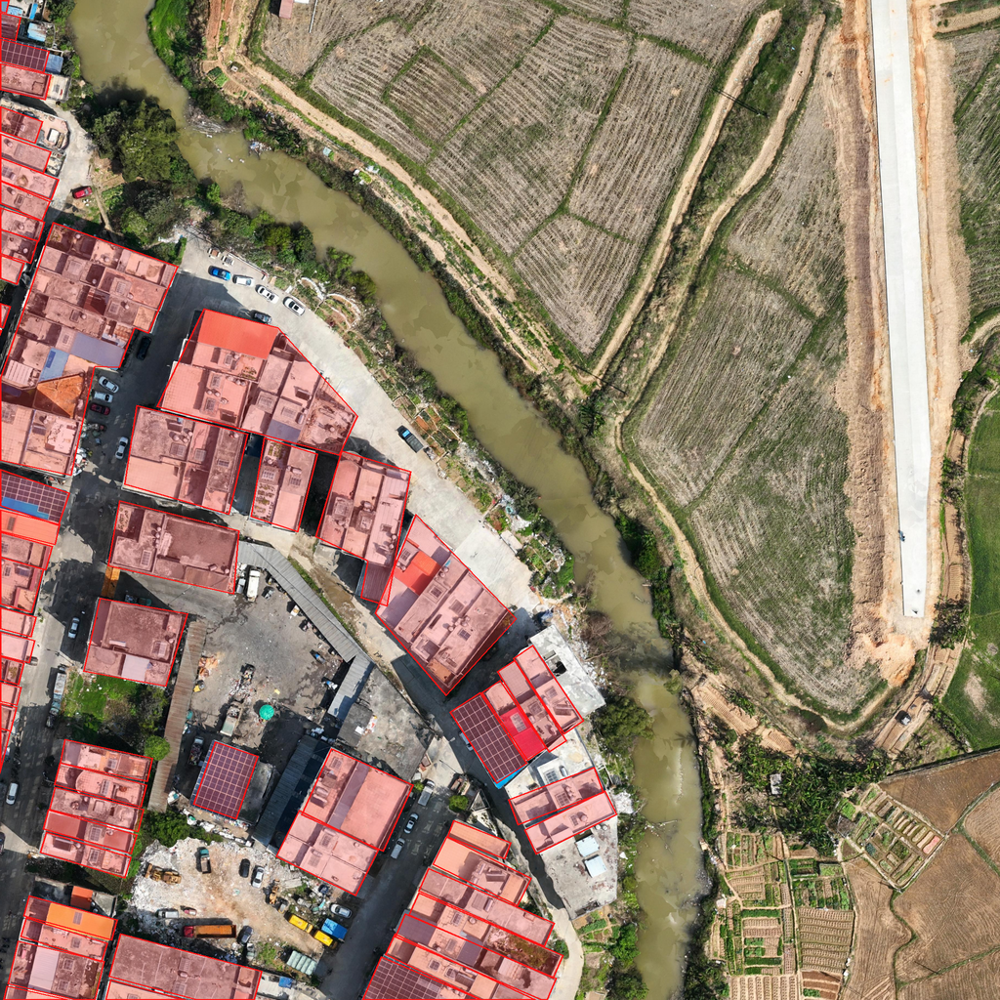

# ArcGIS 建筑物数据制作与 PaddleRS 训练教程

这个仓库用一份小型真实遥感数据，演示如何完成建筑物标注、数据切片、数据集划分和 PaddleRS 模型训练。语义分割是主线，后面还提供目标检测和 GeoView 模型检验教程。

> 演示数据只用于学习和运行教程，不能代替正式训练数据。使用限制见 [DATA_LICENSE.md](DATA_LICENSE.md)。

## 教程流程





## 快速开始

先安装数据处理依赖：

```powershell
python -m pip install -r requirements.txt
```

然后依次运行：

```powershell
# 1. 检查影像和Shapefile是否匹配
python scripts/check_spatial_match.py

# 2. 导出512×512影像和PNG标签
python scripts/export_segmentation_tiles.py

# 3. 划分训练集、验证集和空间缓冲集
python scripts/split_segmentation_dataset.py

# 4. 使用少量样本检查PaddleRS训练流程
python scripts/train_unet.py --smoke
```

PaddlePaddle 和 PaddleRS 的安装方式见[第4章](tutorials/04_paddlers_unet.md)。

## 不想使用命令行？

可以使用图形界面工具 [Remote-sensing-image-Segment](https://github.com/Sa4pphire/Remote-sensing-image-Segment) 制作影像和标签切片。

本仓库中的Python脚本仍然完整保留，适合学习切片原理、批量运行和二次开发。两种方式的详细说明见[第3章](tutorials/03_segmentation_tiles.md)。

## 演示数据和参考结果

- 演示影像：2048×2048，配套58个建筑物面；
- 演示切片：29对，其中训练14、验证10、缓冲5；
- 完整项目：共制作2,489对建筑物切片；
- UNet最佳模型：第12轮，验证集mIoU为0.7233。

演示数据只用于跑通流程，完整结果说明见[这里](docs/full-project-results.md)。

## 教程目录

1. [在ArcGIS Pro中标注建筑物](tutorials/01_arcgis_annotation.md)
2. [检查影像和标注是否匹配](tutorials/02_spatial_preflight.md)
3. [制作语义分割切片](tutorials/03_segmentation_tiles.md)
4. [使用PaddleRS训练UNet](tutorials/04_paddlers_unet.md)
5. [预测并理解模型指标](tutorials/05_prediction_and_evaluation.md)
6. [制作VOC数据并训练PP-YOLO Tiny](tutorials/06_object_detection_extension.md)
7. [把训练模型导入GeoView检验效果](tutorials/07_geoview_deployment.md)

## 许可

- 代码和文档：[MIT License](LICENSE)
- 演示数据：[仅限本教程和学习使用](DATA_LICENSE.md)

